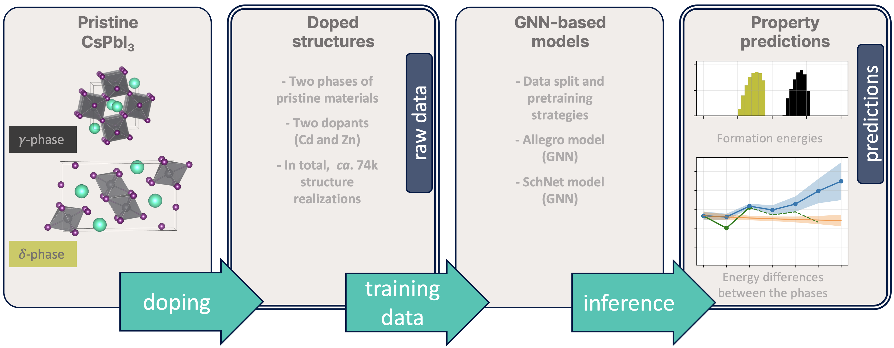

# Cd- and Zn-doped CsPbI<sub>3</sub> Energetics: DFT-derived Properties and GNN-based Predictions

Doping of inorganic lead halide perovskite $\gamma$-CsPbI<sub>3</sub> is aimed at discovering a new stable semiconductor promising for optoelectronic devices. This process can naturally be represented as computer modeling and prediction of the properties of disordered crystal structures. In more detail, a key component of such modeling is the assessment of the thermodynamic properties of a wide range of structural realizations of the candidate material, which forms an expanded composition/configuration space. Due to the size of such spaces, the application of density functional theory (DFT) calculations is accompanied by modern data-driven solutions, e.g. those based on graph neural network (GNN) architectures.
<!--
More details can be found in the [paper](link).

If you are using this dataset in your research paper, please cite us as
```
bibtex citation
```
-->



Dataset
-----
The dataset contains  Cd- and Zn-doped CsPbI<sub>3</sub> systems in two polymorphic modifications and predictions of their formation energies made using various GGNs trained on the DFT derived properties.
In our pipeline, we used 
* three pretraining mode: no pretraining, pretraining on the whole [Open Catalyst Project](https://opencatalystproject.org/index.html) (OCP) dataset and pretraining on a specially selected slice of the[ Aflow](https://www.aflowlib.org) database;
* two architectures: *SchNet* and *Allegro* (for more informations see the [Models sections](https://github.com/AIRI-Institute/doped_CsPbI3_energetics/edit/main/README.md#models));
* and two model types: *both-both* and *element-both*, which means that for the first type the training set contains both Cd-doped systems and Zn-doped systems in both phases, while the for the second one (*element-both*) the training set contains only Cd-doped systems or Zn-doped (in both phases again).
For each combination, listed in the table below, we created 48 train-validation splits with 12 different distribution of defects and trained 48 (96 for *element-both*) models.


<div align="center">
  
|   pretraining mode  | both-both       | element-both    |
|-------|-----------------|-----------------|
| non-pretrained  | [SchNet](https://github.com/AIRI-Institute/doped_CsPbI3_energetics/blob/main/data/nn%20inference/both_both_schnet_non-pr.pkl.gz), [Allegro](https://github.com/AIRI-Institute/doped_CsPbI3_energetics/blob/main/data/nn%20inference/both_both_allegro_non-pr.pkl.gz) | [SchNet](https://github.com/AIRI-Institute/doped_CsPbI3_energetics/blob/main/data/nn%20inference/element_both_schnet_non-pr.pkl.gz), [Allegro](https://github.com/AIRI-Institute/doped_CsPbI3_energetics/blob/main/data/nn%20inference/element_both_allegro_non-pr.pkl.gz) |
| OCP   | [Allegro](https://github.com/AIRI-Institute/doped_CsPbI3_energetics/blob/main/data/nn%20inference/both_both_allegro_ocpr.pkl.gz)           | [Allegro](https://github.com/AIRI-Institute/doped_CsPbI3_energetics/blob/main/data/nn%20inference/element_both_allegro_ocpr.pkl.gz)           |
| Aflow | [Allegro](https://github.com/AIRI-Institute/doped_CsPbI3_energetics/blob/main/data/nn%20inference/both_both_allegro_aflowpr.pkl.gz)           | [Allegro](https://github.com/AIRI-Institute/doped_CsPbI3_energetics/blob/main/data/nn%20inference/element_both_allegro_aflowpr.pkl.gz)           |
</div>

Thus, each presented pandas dataframe contains atomic numbers (i.e. systems itself), metainformation columns, DFT-calculated energies, subsample indicators and 48 (mentioned earlier) GNN predictions. Atomic numbers, metainformation, DFT_energies and subsample indicators are identical in all datasets. More detailed description you can find in the table below.
<div align="center">

| ordinal number | column tag | content description |
| --- | --- | --- |
|1| phase | yellow/black (corresponds to the phase studied) |
|2| supercell | the supercells used (depends on phase) |
|3| subst | the number of substituted Pb positions |
|4| index | structure id (unique within a certain composition) |
|5| weight | corresponds to the number of symmetrically equivalent structures within combinatorial composition/configuration space |
|6| dopant | Cd/Zn (dopant type in the structure) |
|7| space_group_number | space symmetry of the doped structure before relaxation |
|8| formula | chemical formula (OrderedDict type) |
|9| natoms | 160 (the number of atoms in the model cells - constant feature) |
|10| atomic_numbers | atomic numbers of the structure |
|11| nelements | the number of chemical elements in the structure |
|12| cell | model cell sizes (before relaxation - constant feature for a certain phase) |
|13| pos | atomic positions (before relaxation) |
|14-61| val_i | GNN-predicted formation energy per atom (in eV/atom) for the $i^{th}$ validation subset |
|62| relaxed_cell_DFT | model cell sizes after DFT relaxation |
|63| relaxed_pos_DFT | DFT-relaxed atomic positions |
|64| relaxed_pressure_DFT | pressure (in kbar) for the DFT-relaxed structure |
|65| relaxed_forces_DFT | atomic forces (in eV/angstrom) for the DFT-relaxed structure |
|66| relaxed_energy_DFT | relaxed energy per cell (in eV) for the DFT-relaxed structure |
|67| relaxed_energy_pa_DFT | relaxed energy per atom (in eV/atom) for the DFT-relaxed structure |
|68| formation_energy_pa_DFT | formation energy per atom (in eV/atom) for the DFT-relaxed structure |
|69-116| val_i_DFT | boolean flag showing whether the configuration is in the $i^{th}$ validation subset |
|117| inWhichPart | tr_val, test, or inference (corresponds to the data usage within the approach proposed)|
</div>

<!--
| **Sample** | **Size** |
|:----------:|:--------:|
|  train_val |    142   |
|    test    |    60    |
|  inference |   73760  |
-->

Scripts
-----
The repository also contains a [Jupyter Notebook](https://github.com/AIRI-Institute/doped_CsPbI3_energetics/blob/main/data%20processing.ipynb) file with utils and visualisation scripts. You can calculate and visualise energy distributions, RMSEs, predictions, etc.

Models
-----
* [SchNet: A continuous-filter convolutional neural network for modeling quantum interactions](https://arxiv.org/abs/1706.08566)
* [Learning Local Equivariant Representations for Large-Scale Atomistic Dynamics (Allegro)](https://arxiv.org/abs/2204.05249)
