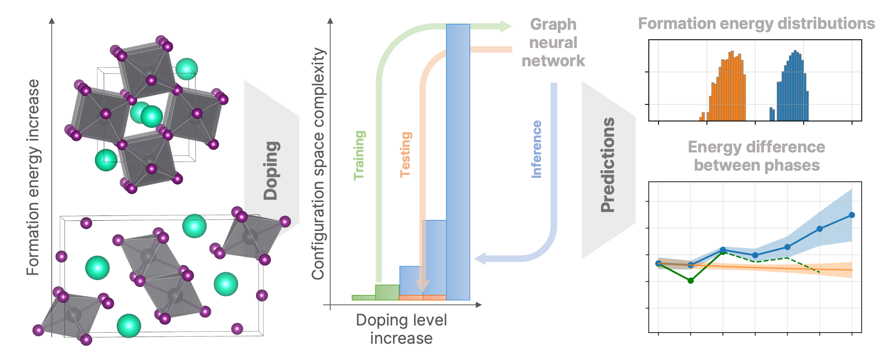

# Graph Neural Networks for Predicting Structural Stability of Cd- and Zn-doped $\gamma$-CsPbI<sub>3</sub>



Computational modeling of disordered crystal structures is essential for the study of composition-structure-property relations for many families of functional materials.
Efficient and reliable solutions are of great interest due to the promising reduction of labor-intensive calculations through data-driven prediction of target properties.
One of the modern problems directly related to this topic is the enhancement of phase stability of functional materials with the required properties.
In this work, we study the effects of Cd- and Zn-doping of iodide-rich 
inorganic lead halide perovskite CsPbI<sub>3</sub>.
This material has unique properties for optoelectronics, but undergoes an undesirable phase transition -- from the "black" to 16 meV/atom more favored "yellow" phase.
This promising for optoelectronic devices semiconductor undergoes an undesirable phase transition from the direct band gap "black" to indirect "yellow" phase at room temperature.
For evaluations of thermodynamic properties of the doped materials, combine the density functional theory (DFT) calculations and graph neural network (GNN) models.
At low doping, the reduced composition/configuration spaces comprising *ca*. 200 structures were studied using DFT.
The GNN models were trained on the DFT-derived properties of these structures.
For higher dopant contents, the trained GNN models were used to predict thermodynamic properties of *ca*. 74k structure realizations and evaluate resulting energy differences between the phases.
Because of the lack of the DFT-derived data, an impact of the data sampling on the quality of predictions is comprehensively studied and series of transfer learning routines is tested using available DFT-based datasets.
For the examined models, the root-mean-square errors of *ca*. 0.7 meV/atom are achieved in the predictions of formation energies for doped structures.
The data treatment workflows proposed and tested in this study open up perspectives for data-driven research of doped materials of particular interest with low computational costs.

More details can be found in the [paper](link).


Citation
-----
```
bibtexcitation
```

Models
-----
* [Schnet](https://arxiv.org/abs/1706.08566)
* [Allegro](https://arxiv.org/abs/2204.05249)
